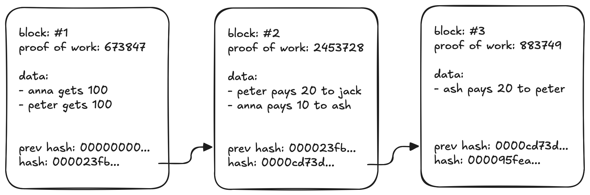

### What problem does blockchain solve?
Trust: it allows strangers that don't trust each other to make commitment without the need for a human/institutional middleman.

### Why can we trust commitments on blockchain?&nbsp;

1. <b>verified&nbsp;cryptographically</b>: only you can make them for yourself

2. <b>immutable</b>: commitments can never be removed, changed or tampered with

Note: this assumes the majority of the network acts honestly.

### Does blockchain eliminate trust entirely?
No - instead of trusting people/companies, we trust math and code to execute predictably.

### What are the cons of blockchain?
<ul><li>
<b>consensus overhead</b>:&nbsp;slow throughput due to distributed consensus
</li><li>
<b>governance challenges</b>: decentralized systems struggle with coordinated upgrades and dispute resolution
</li><li>
<b>storage redundancy: </b>every node stores the full blockchain history
</li></ul>

### What are the pros of blockchain?
<ul><li><strong>no human/institutional middleman</strong>&nbsp;</li><li><b>transparent</b>: everyone can verify complete history </li><li><b>cryptographic security</b>: guarantees data integrity and authenticity </li><li><strong>immutable</strong>: no tampering with historical records</li></ul>

### What is the difference between web3 and blockchain?
Web3 is a vision for the next generation of internet, blockchain is the technology it's built upon.

### What does blockchain look like?

### 
<strong>How does a transaction become part of the blockchain?</strong>

<ol><li>Creator cryptographically signs the transaction, proving ownership</li><li>Creator publishes the transaction to the network</li><li>The transaction gets added to the mempool</li><li>Block producers select transactions from the mempool</li><li>Block producers create and validate the block</li><li>Block producers propose the block to the network</li><li>The network validates the block and if accepted adds it to the blockchain</li></ol>

### What is a mempool?
A memory pool - a waiting area where unconfirmed transactions are stored, waiting to be processed.

### How do block producers prioritize which transactions to include in their next block?
Typically transactions with higher fees are processed first, as the producer earns those fees as rewards when their block is accepted.